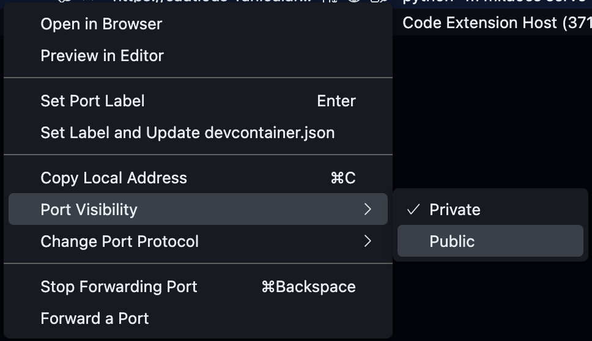

<!-- markdownlint-disable MD033 MD046 -->

# :test_tube: Implement Features

!!! quote ":moneybag: Enable rapid onboarding to project development"

    > _Our goal is to create a **Tetris Game** to delight our site visitors, without losing time to complex project onboarding process nor complications due to tool-bloat._
    >
    > Currently, navigating to the **Tetris Game** page of the workshop site shows that the _feature_ is currently missing. We will address that issue in this exercise.
    >
    > 

## Exercise: Integrate the **Tetris Game**

Refer back to the Codespaces development environment created in the [prerequisite to the workshop](../../prerequisites.md#provision-a-new-cloud-development-environment-for-the-workshop).(1)
{ .annotate }

1. **:octicons-info-16:{ style="color: yellow" } Your Codespace may have stopped due to inactivity.**

   - _If the browser tab with your Codespace remains open and you can find it_, click <span class="gh-button-green">Restart codespace</span> to resume.
     
   - Otherwise, you can find it at the new repository you had created.
     

---

### **:material-numeric-1-circle: Explore your Codespace**

=== "1.1 Understand Your Codespace"

    Your codespace was provisioned as declared in `.devcontainer/devcontainer.json`.

    ```json title=".devcontainer/devcontainer.json" linenums="1" hl_lines="11"
    {
      "hostRequirements": { /*(1)*/
        "cpus": 4,
        "memory": "16gb",
        "storage": "32gb"
      },
      "build": {
        "dockerfile": "./Dockerfile", /*(2)*/
        "context": ".."
      },
      "postAttachCommand": "python -m mkdocs serve --clean --dev-addr 127.0.0.1:8080", /*(3)*/
      "forwardPorts": [
        8080
      ],
      "containerEnv": {
        "TETRIS_APP_HOST": "127.0.0.1",
        "TETRIS_APP_PORT": "8080",
        "TETRIS_APP_PATH": "github-devsecops-fundamentals"
      },
      ...
    ```

    1. You can customize the compute resource to be made available for the Codespace environment, to suit your project.
    2. A `Dockerfile` can be used to customize the Codespace container image, for instance you may choose to consistently pre-install dependencies required for the development environment.
    3. Tasks may be configured to be executed at the start of each development session e.g. running a development server.

    {==

    On the **`TERMINAL`** view at the bottom, notice that a local site server is already running. **This is as a result of the `postAttachCommand` configuration entry in `.devcontainer/devcontainer.json`**.

    ==}

    Looking at the build log in the terminal, you can see a warning like the one in the following example.(1)
    { .annotate }

    1. 💡 The warning gives a cue to addressing the Tetris Game integration issue. We shall implement the fix in later steps!

    

    :fire: The log `INFO` entry that reads **`INFO    -  [05:36:30] Watching paths for changes: 'docs', 'mkdocs.yml'`** informs you that thelocal site will rebuild whenever there is a change in the `docs` folder.

=== "1.2 Enable Quick Collaboration Feedback"

    Switch to the **`PORTS`** view on the bottom panel, notice there is a **`Site (8080)`** entry in the table.

    1. Focus your :fontawesome-solid-hand-pointer: mouse pointer on the **`Site (8080)`** to reveal additional contexts.
    1. Click the **:material-file-search-outline: Preview in Editor** icon to browse the local build of the site inside of the editor's browser.(1)
        { .annotate }

          1. - :warning: **Only you currently have access to the published site.**
             - :bulb: You may instead click the **:octicons-globe-16:** icon associated with **`Site (8080)`** entry to view the site in your normal browser.

    **Open access to other stakeholders for collaboration.**

    1. Right click on the **`Site (8080)`** entry
    1. In the popup menu, set the mouse pointer on the **Port Visibility** item and select the **Public** option.
        { style="width: 40em" }

    !!! tip ":octicons-goal-16:{ style="color: red" } Facilitate Collaboration"

        Now, other stakeholders you share the site URL with can access the site. Consequently, they can also assess your ongoing work and can collaborate with timely feedbacks.

---

### **:material-numeric-2-circle: Automated Checks**

GitHub as a platform, is event-driven. Beyond the ordinary, you can generally automate your actual business processes by modelling activities to produce changes on GitHub, thus triggering execution of certain automated tasks depending on the nature of a change.

At this phase of fundamentals introduction to DevSecOps, we shall focus our leverage of GitHub's powerful event system to drive {== **continuous integration** ==} checks and tests with GitHub Workflows.

=== "2.1 Learn GitHub Actions"

    ```yaml title="Anatomy of a GitHub Workflow"
    name: Learn GitHub Actions #(1)

    run-name: ${{ github.actor }}  is learning GitHub Actions #(2)

    on: [push] #(3)

    permissions:
        contents: read

    jobs: #(4)

        check-bats-version: #(5)

            runs-on: ubuntu-latest #(6)

            steps: #(7)

                - uses: actions/checkout@v4 #(8)

                - uses: actions/setup-node@v3 #(9)
                  with:
                      node-version: '14'

                - run: npm install -g bats #(10)

                - run: bats -v #(11)
    ```

    1. `Optional` - The name of the workflow as it will appear in the "Actions" tab of the GitHub repository. If this field is omitted, the name of the workflow file will be used instead.
    2. `Optional` - The name for workflow runs generated from the workflow, which will appear in the list of workflow runs on your repository's "Actions" tab. This example uses an expression with the `github` context to display the username of the actor that triggered the workflow run. For more information, see "[Workflow syntax for GitHub Actions](https://docs.github.com/en/actions/using-workflows/workflow-syntax-for-github-actions#run-name)."
    3. Specifies the trigger for this workflow. This example uses the `push` event, so a workflow run is triggered every time someone pushes a change to the repository or merges a pull request.  This is triggered by a push to every branch; for examples of syntax that runs only on pushes to specific branches, paths, or tags, see "[Workflow syntax for GitHub Actions](https://docs.github.com/en/actions/reference/workflow-syntax-for-github-actions#onpushpull_requestpull_request_targetpathspaths-ignore)."
    4. Groups together all the jobs that run in the `learn-github-actions` workflow.
    5. Defines a job named `check-bats-version`. The child keys will define properties of the job.
    6. Configures the job to run on the latest version of an Ubuntu Linux runner. This means that the job will execute on a fresh virtual machine hosted by GitHub. For syntax examples using other runners, see "[Workflow syntax for GitHub Actions](https://docs.github.com/en/actions/reference/workflow-syntax-for-github-actions#jobsjob_idruns-on)"
    7. Groups together all the steps that run in the `check-bats-version` job. Each item nested under this section is a separate action or shell script.
    8. The `uses` keyword specifies that this step will run `v4` of the `actions/checkout` action. This is an action that checks out your repository onto the runner, allowing you to run scripts or other actions against your code (such as build and test tools). You should use the checkout action any time your workflow will use the repository's code.
    9. This step uses the `actions/setup-node@v3` action to install the specified version of the Node.js. (This example uses version 14.) This puts both the `node` and `npm` commands in your `PATH`.
    10. The `run` keyword tells the job to execute a command on the runner. In this case, you are using `npm` to install the `bats` software testing package.
    11. Finally, you'll run the `bats` command with a parameter that outputs the software version.

=== "2.2 Implement Automated pull request Checks"

    To enable quality checks in the project at high velocity, implement a workflow that standardizes automated functional test as follows.

    ```yaml title=".github/workflows/1.1.continuous.integration.yml"
    --8<-- "reference.implementations/workflows/1.1.continuous.integration.yml"
    ```

=== "2.3 Implement Merge Queue"

    The previously implemented pull request checks will be executed in isolation. However, to provide assurance of stability on the target branch as different changes are being introduced to it at a fast pace by multiple collaborator, we want to aggregate isolated changes and re-validate them in batches.

    !!! question "Is this like a _Nightly Build_?"

        You probably recognize this concept as similar to the implementation of a nightly build. **Except you do not have to wait ~ 24 hours or there about to validate your project's quality status.**

    A Merge Queue is ideal for rolling out continuous integration at scale, enabling larger projects and teams to be optimally productive -- delivering high quality value without compromising product stability.

    Implement the Merge Queue as follows.

    ```yaml title=".github/workflows/1.2.continuous.integration.yml"
    --8<-- "reference.implementations/workflows/1.2.continuous.integration.yml"
    ```

Having completed continuous integration implementation commit and publish your changes.

1. Commit and push the changes.

    ```bash
      git checkout -b feature/tetris-game
      git add .github/workflows/1.1.continuous.integration.yml
      git add .github/workflows/1.2.continuous.integration.yml
      git commit -m "Implement continuous integration"
      git push -u origin feature/tetris-game
    ```

1. Once you've committed changes to your local copy of the repository, click the Create Pull Request icon.

    

    Check that the local branch and repository you're merging from, and the remote branch and repository you're merging into, are correct. Then give the pull request a title and a description.

---

5. Rename the **`docs/.tetris.game`** folder to **`docs/tetris.game`**, i.e. simply remove the `.` prefix from the name.
6. Find and open the file **`mkdocs.yml`** in the File Explorer (it's at the root of the file tree)

   - Fix the the `Tetris Game` relevant entry and point the value of the entry to the `tetris.game` folder

     ```yaml linenums="153" hl_lines="20"
     nav:
       - index.md
       - Prerequisites: prerequisites.md
       - Exercises:
           - Introduction: exercises/index.md
           - Collaborate:
               - exercises/01.collaborate/index.md
               - exercises/01.collaborate/01.md
               - exercises/01.collaborate/02.md
               - exercises/01.collaborate/03.md
           - Secure the Software Supply Chain:
               - exercises/02.secure.the.software.supply.chain/index.md
               - exercises/02.secure.the.software.supply.chain/00.md
               - exercises/02.secure.the.software.supply.chain/01.md
               - exercises/02.secure.the.software.supply.chain/02.md
               - exercises/02.secure.the.software.supply.chain/02-extra.md
           - Automate-Release:
               - exercises/03.automate.release/index.md
               - exercises/03.automate.release/01.md
       - Tetris Game: tetris.game/index.html #(1)
     ```

     1. Here, change `.tetris.game/index.html` to `tetris.game/index.html`.

---

### **Test**

#### **Manual Test**

7. Observe the local build in the terminal, there should not be any :warning: `WARNING` in the log.
8. Manually confirm that the Tetris Game integration was effective.
   

#### **Automated Test**

9.  Open the terminal and install test dependencies.(1)
    { .annotate }

    1. 💡 You can create additional terminal session by clicking :octicons-plus-16: at the top right side of the **`TERMINAL`** panel.

    ```shell
    nvm install --lts #(1)
    npm install
    npx playwright install --with-deps chromium #(2)
    ```

    { .annotate }

    2. :octicons-info-16: A codespace environment can be customized as needed. In this case, we customized the running session by installing the latest version of NodeJS.
    3. :octicons-info-16: This command installs browsers required for the functional test. **Please be patient, it may take 1 to 2 minutes to complete the installation.**

    Then implement the functional test as follows.

    ```javascript title="tests/tetris.spec.js"
    --8<-- "reference.implementations/tests/tetris.spec.js"
    ```

    Finally execute the automated test.

    ```shell
    npx playwright test
    ```

    When everything has been done right, the test should pass.
    

10. Add automated checks by creating the following workflows

    ```mermaid
    sequenceDiagram
        participant GA as GitHub Actions

        activate GA
        GA-->>GA: Compile
        GA-->>GA: Build
        GA-->>GA: Unit Test
        GA-->>GA: Integration Test
        GA-->>GA: Code Scanning (CodeQL, Trivy)
        GA-->>GA: Dependency Review
        deactivate GA
    ```

---

11. Commit the changes to a new branch and publish it for a review.

    ```bash

    ```
